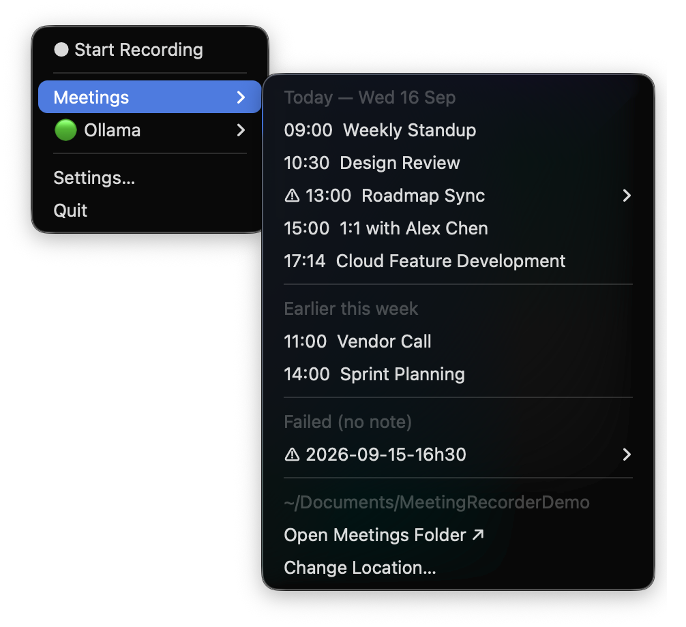

# Meeting Recorder

A macOS menu bar app that records meetings, transcribes locally with whisper.cpp, summarises with an LLM, and writes structured notes into your Obsidian vault.


## What it can do

| | |
|---|---|
| **Record a live meeting** | Captures mic + system audio simultaneously. macOS 14.2+ uses a Core Audio process tap — no driver to install, works on Bluetooth headphones. Older versions fall back to BlackHole. After stopping, a dialog takes an optional meeting name and context for the AI. |
| **Import a local audio/video file** | **Import Recording…** in the menu accepts any file your system can decode (mp3, m4a, mp4, mov, …). The original is never moved. The same dialog lets you confirm the recording date/time, set an optional title, and add context (attendees, project names, terms). |
| **Scrape a Stream/Teams recording** | **Import Transcript from Stream… ↗** opens a dialog asking for the recording URL. Fields: optional **Title**, optional **Frames at** (timestamps for screenshare screenshots embedded in the note), optional **Context**. The scrape runs in Terminal with a real Chrome window — sign-in and opening the transcript panel are manual steps. |
| **Summarise with any LLM** | Default: local **Ollama** (offline, no key needed). Also supports any **OpenAI-compatible API** and the **Anthropic Messages API** — including local gateways. Configured in Settings → Summarizer or the `[llm]` table in config.toml. API key lives in the macOS Keychain (never in the config file). Model list in Settings is fetched live from the endpoint's `/models`. |
| **Names & terms** | A persistent list of names and technical terms sent with every summary so the model spells them consistently. Set in Settings → Summarizer → Names & terms. |
| **Automatic Ollama fallback** | When a hosted API is unreachable (e.g. off VPN), the app falls back to Ollama rather than losing the summary. Turn it off in Settings → Summarizer or with `fallback_to_ollama = false`. |
| **Retry failed summaries** | If any pipeline stage fails, audio is preserved. A ⚠ entry in Meetings ▸ lets you retry when the problem is resolved. |

System audio is captured with a **Core Audio process tap**, so there is no audio driver to install and nothing to configure. It works whatever you are listening on, Bluetooth earbuds included.

## How it works

```
Mic ─────────────────────────────────────────────┐
                                                  ▼
System audio (Core Audio tap) ─────────► Two-pass transcription
                                                  │
                                          whisper.cpp (local)
                                                  │
                                         Merge + dedup bleed
                                                  │
                                    Ollama / OpenAI / Anthropic API
                                                  │
                                        Obsidian note (.md)
```

After you click **Stop Recording**, a modal lets you name the meeting and add context for the AI. The pipeline then runs in the background — transcription, summary, and a note saved to your vault. If you skip naming, the LLM picks a title automatically.

---

## Prerequisites

### 1. System audio — nothing to install

On **macOS 14.2 or newer** the app captures system audio with a Core Audio process tap. There is no driver to install, no Multi-Output Device to build, and no need to change your output before a meeting. Volume keys keep working, and your listening device — speakers, wired headphones, Bluetooth earbuds — makes no difference, because the tap reads the audio before it reaches any of them.

macOS will ask for audio-recording permission the first time you record. Grant it once.

<details>
<summary>On macOS older than 14.2 (legacy BlackHole setup)</summary>

The tap is unavailable, so the app falls back to a loopback device and tells you it has done so. That path needs setup:

1. Install BlackHole from [existential.audio/blackhole](https://existential.audio/blackhole/)
2. Open **Audio MIDI Setup** (Applications → Utilities)
3. Click **+** → **Create Multi-Output Device**
4. Check **BlackHole 2ch** and your speakers/headphones
5. Right-click the new device → **Use This Device for Sound Output**

All members of a Multi-Output Device must share a sample rate. Bluetooth earbuds commonly run at 44100 while BlackHole defaults to 48000; when they disagree macOS drops the mismatched device without warning, so you hear nothing. Match the rates in Audio MIDI Setup, or use wired output.

With a Multi-Output Device selected the macOS volume keys do not work. Adjust volume on the hardware itself, or switch output temporarily.

</details>

### 2. whisper.cpp — local transcription

```bash
brew install whisper-cpp
```

Download the large-v3 model (~3 GB):

```bash
# Find your installed version
brew info whisper-cpp

# Download the model (adjust version path as needed)
curl -L -o /opt/homebrew/Cellar/whisper-cpp/1.8.4/share/whisper-cpp/ggml-large-v3.bin \
  "https://huggingface.co/ggerganov/whisper.cpp/resolve/main/ggml-large-v3.bin"
```

### 3. Ollama — local LLM summarization (default)

Download from [ollama.com](https://ollama.com), then:

```bash
ollama pull llama3.1:8b   # ~5 GB, works well on 16 GB+ RAM
ollama serve              # start before using the app
```

> **Resource usage:** `ollama serve` idles at ~50–100 MB RAM with no active requests — it's cheap to leave running all day. The 8B model only loads into GPU/RAM when a request comes in (i.e. after you stop a recording), then unloads after a short timeout. You won't notice it while working normally.

Ollama is the default and works entirely offline. To use a hosted or gateway API instead, see [Summarizer configuration](#summarizer-configuration) below.

---

## Running the app

### Option A — pre-built app bundle (recommended)

Build the `.app` once:

```bash
git clone https://github.com/ayushb3/meeting-recorder
cd meeting-recorder
python3 -m venv .venv
.venv/bin/pip install -r requirements.txt
.venv/bin/pyinstaller meeting_recorder.spec
```

This produces `dist/Meeting Recorder.app`. Double-click it (or copy to `/Applications`).

**First launch:** the app opens your config file automatically. Fill in your paths, save, then relaunch.

> To share with a teammate: zip `dist/Meeting Recorder.app` and send it. On first open they right-click → Open to bypass Gatekeeper, then edit the config that pops up.

### Option B — run from terminal (dev)

```bash
git clone https://github.com/ayushb3/meeting-recorder
cd meeting-recorder
python3 -m venv .venv
.venv/bin/pip install -r requirements.txt
.venv/bin/python app.py
```

> **System audio will be silent this way.** macOS grants audio capture to an app bundle launched through LaunchServices — Finder, the Dock, or `open`. A process started from a shell inherits the terminal's privacy context and is refused, and the refusal is silent: the recording succeeds and the system track contains nothing but zeroes. Use this mode for menu and pipeline work, and build the bundle to test recording.

---

## Configuration

On first launch the app copies a template to:

```
~/Library/Application Support/MeetingRecorder/config.toml
```

**Settings…** in the menu bar opens a window with a folder picker and device dropdowns. It writes the same file, so you can edit it by hand instead if you prefer.


```toml
[paths]
output_dir = "~/Documents/Obsidian/Meetings"   # where notes are saved

[audio]
capture_method = "auto"        # "auto" | "tap" | "blackhole" — see below
system_device  = "BlackHole 2ch"   # only used by the "blackhole" path
mic_device     = "MacBook Pro Microphone"   # run: python3 -c "import sounddevice; print(sounddevice.query_devices())"

[whisper]
binary = "/opt/homebrew/bin/whisper-cli"
model  = "/opt/homebrew/Cellar/whisper-cpp/1.8.4/share/whisper-cpp/ggml-large-v3.bin"

[ollama]
model = "llama3.1:8b"
host  = "http://localhost:11434"
# prompt = "..."   # optional: replace the built-in summary prompt.
                   # Must contain {transcript}; may contain {context}.

[llm]
# Which backend writes the summary. Default: "ollama" (local, offline).
# "openai"    — any OpenAI-compatible Chat Completions API
# "anthropic" — the Anthropic Messages API
# base_url includes the version segment, e.g.:
#   https://api.openai.com/v1
#   https://api.anthropic.com/v1
#   http://localhost:6655/openai/v1  (local gateway)
provider          = "ollama"
base_url          = ""
model             = ""
terms             = ""     # names/terms sent with every summary; comma-separated or one per line
fallback_to_ollama = true   # fall back to Ollama when the hosted API is unreachable

[processing]
keep_audio             = true   # keep .wav files alongside notes
min_recording_seconds  = 30     # discard accidental short recordings
low_disk_threshold_mb  = 500    # auto-stop if disk is low
mic_threshold          = 300    # mic RMS gate (0–32767), suppresses speaker bleed
```

### Summarizer configuration

The `[llm]` table controls which model writes summaries. Three providers are supported:

| `provider` | What it connects to |
|---|---|
| `ollama` (default) | Local Ollama server at `[ollama] host`. Fully offline. |
| `openai` | Any OpenAI-compatible Chat Completions endpoint (`/v1/chat/completions`). Set `base_url` to `https://api.openai.com/v1` or a local gateway such as `http://localhost:6655/openai/v1`. |
| `anthropic` | The Anthropic Messages API. Set `base_url` to `https://api.anthropic.com/v1` or a gateway that speaks the Anthropic protocol. |

**API key — stored in the macOS Keychain, not in config.toml.** Add it once:

```bash
security add-generic-password -s MeetingRecorder -a llm-api-key -w
# (prompts for the key)
```

For scripts and tests, the `MEETING_RECORDER_LLM_KEY` environment variable is also accepted.

**`fallback_to_ollama = true`** means that if the hosted endpoint is unreachable (e.g. off VPN), the summary is retried against Ollama rather than being lost. The note is still written and the summary is added when the retry succeeds.

**`terms`** is a persistent list of names and technical terms (comma-separated or one per line) sent with every summary so the model uses consistent spelling. Edit it in Settings → Summarizer → Names & terms, or directly in config.toml.

The **Settings → Summarizer** section in the app mirrors all of these fields. When a `base_url` and API key are present, the model dropdown is populated live by querying the endpoint's `/models` list.

### capture_method

| Value | Behaviour |
|---|---|
| `auto` (default) | Use the tap when the system supports it, otherwise the loopback device. Falling back is announced, never silent. |
| `tap` | Require the tap. Fails rather than falling back — useful when diagnosing. |
| `blackhole` | Always use the loopback device named in `system_device`. |

---

## Usage

1. Start Ollama: `ollama serve` (or use **Ollama ▸ Start Ollama in Terminal ↗**). Skip if you are using a hosted API instead.
2. Launch **Meeting Recorder** — it lives in the menu bar, with no Dock icon
3. Click **Start Recording** before your meeting starts
4. Click **Stop Recording** when done
5. A dialog appears — optionally enter a suggested title and context for the AI summary, then click **Process**
6. Wait for the notification: "Note saved — *Your Meeting Title*". Click it to open the note

Recording never waits on the summarizer. If the model is unreachable the transcript is still captured and written; the note is marked and can be reprocessed later.

### Importing a local audio or video file

**Import Recording…** in the menu opens a file picker. Select any audio or video file (mp3, m4a, wav, mp4, mov, and any format your system can decode). A dialog then lets you:

- Confirm or correct the recording date and time (pre-filled from the file's modification date)
- Set an optional meeting title
- Add optional context for the AI (attendees, project names, technical terms)

The original file is never moved or modified.

### Importing a meeting you did not record

For a Teams/Stream recording made by someone else, **Import Transcript from Stream… ↗** takes
the recording's URL and scrapes the transcript into a note, with real speaker names. The dialog
accepts an optional title, optional screenshare frame timestamps (**Frames at**), and optional
context. See [Importing Stream transcripts](docs/stream-transcripts.md) for setup and the
manual steps it needs.

### The menu



```
● Start Recording              ■ Stop Recording — 12:34 while recording
────────
Meetings ▸        Today — Wed 16 Sep
                  09:00  Standup
                  11:00  Platform Roadmap
                  15:00  ⚠ 15:00  Product Review     ← summary failed, retry inside
                  ────────
                  Earlier this week
                  Mon    Design Review
                  ────────
                  ~/Documents/Obsidian/Meetings
                  Open Meetings Folder ↗
                  Change Location…
Import Recording…
Import Transcript from Stream… ↗
🟢 Ollama ▸       🟢 Running                    (shows 🟢/🔴 Summarizer when a hosted API is configured)
                  llama3.1:8b · localhost:11434
                  ────────
                  Start Ollama in Terminal ↗
                  Pull Model… ↗
                  Refresh Ollama Status
────────
Settings…
Quit
```

The root menu is a fixed size — meetings live in the submenu, so it does not grow with the number of meetings in a day.

| Item | Notes |
|---|---|
| Start / Stop Recording | Shows elapsed time while recording, then *Processing…* until the note is written |
| Meetings ▸ | Recent notes grouped by day. Click one to open it. A ⚠ entry has a **Retry Summary** child |
| Import Recording… | Import a local audio/video file. Dialog: date/time, optional title, optional context |
| Import Transcript from Stream… ↗ | Scrapes a recording you did not make. Dialog: URL, optional title, optional frame timestamps, optional context. Opens Terminal and a browser — see [the guide](docs/stream-transcripts.md) |
| 🟢/🔴 Ollama ▸ | When provider is Ollama: 🟢 ready, 🟡 model not pulled, 🔴 unreachable. When a hosted API is configured: shows as **Summarizer** with 🟢/🔴 |
| Settings… | Folder picker, audio device dropdowns, summarizer config, names & terms, and the rest |

---

## Output structure

```
~/Documents/Obsidian/Meetings/
└── 2026-W16/
    └── q2-planning-with-design-team/
        ├── meeting.md
        ├── audio-mic.wav
        └── audio-system.wav
```

Each note:

```markdown
---
date: 2026-04-14
time: 09:54
duration: 19m
tags: [meeting, transcript]
title: Q2 Planning With Design Team
---

## TL;DR
...

## Topics Covered
...

## Key Decisions
...

## Action Items
- Alice — send revised timeline by Friday

## Audio

![[audio-mic.wav]]
![[audio-system.wav]]

## Full Transcript
[00:00] Hello everyone...
```

---

## Launch on startup

### Meeting Recorder

Copy the app to `/Applications` first, then add it to Login Items:

**macOS Ventura / Sonoma (13+):**
System Settings → General → Login Items → click **+** → select `Meeting Recorder.app`

**Older macOS:**
System Preferences → Users & Groups → Login Items → click **+** → select `Meeting Recorder.app`

### Ollama

The Ollama desktop app (from [ollama.com](https://ollama.com)) auto-starts on login by default once installed — no extra steps needed. If you installed via Homebrew instead:

```bash
# Register as a background service that starts on login
brew services start ollama
```

To verify it's running: `curl http://localhost:11434` should return `Ollama is running`.

---

## Error recovery

Audio is always preserved. If a stage fails — whisper crash, Ollama down, disk full — a `.error` file is written beside the audio and the session is marked in **Meetings ▸** with a ⚠. Open it and choose **Retry Summary** to re-run the pipeline on the saved audio.

An Ollama outage is a partial failure rather than a total one: the transcript is still written, and only the summary is missing, so the note is useful immediately and improves when you retry.

### "No system audio captured"

Both capture paths fail by producing silence rather than an error, so the app checks the recorded system track and warns when it is empty. If you see this:

- **Using the tap** — grant audio recording permission in System Settings → Privacy & Security → Microphone, then record again. Note that a terminal-launched `python app.py` is always refused; see Option B above.
- **Using BlackHole** — your output is not routed through the loopback device. Check the Multi-Output Device is selected and its members share a sample rate.

---

## Development

```bash
# Run tests
.venv/bin/pytest tests/ -v

# Rebuild the app bundle
.venv/bin/pyinstaller meeting_recorder.spec
```

---

## Documentation

| Document | What it covers |
|---|---|
| [Getting Started](docs/getting-started.md) | First-time setup, build or receive the app, configure, and record your first meeting |
| [Menu Reference](docs/menu-reference.md) | Every menu item, what it does, and when it is enabled |
| [Importing Stream transcripts](docs/stream-transcripts.md) | Getting a transcript out of a meeting someone else recorded |
| [Troubleshooting](docs/troubleshooting.md) | Symptom-first guide to common problems |
| [Diagrams](docs/diagrams/) | Pipeline flow, capture architecture, and menu tree as SVGs |
| [Screenshots](docs/screenshots/README.md) | Guide to the screenshots that can be captured and where to drop them |

---

## Stack

| Component | Library |
|---|---|
| Menu bar UI | `rumps` |
| Settings window | PyObjC / AppKit |
| System audio | Core Audio process tap (PyObjC + ctypes) |
| Mic capture | `sounddevice` + `soundfile` |
| Transcription | `whisper.cpp` (subprocess) |
| Summarization | Ollama local HTTP API, OpenAI-compatible API, or Anthropic Messages API (`summarizer/llm.py`) |
| Config | `tomllib` (stdlib) |
| Bundling | PyInstaller 6.x |

## Requirements

- macOS 14.2+ for driverless system audio capture; older versions fall back to BlackHole
- The app must be launched as a bundle (Finder, Dock, or `open`) for system audio capture to be permitted
