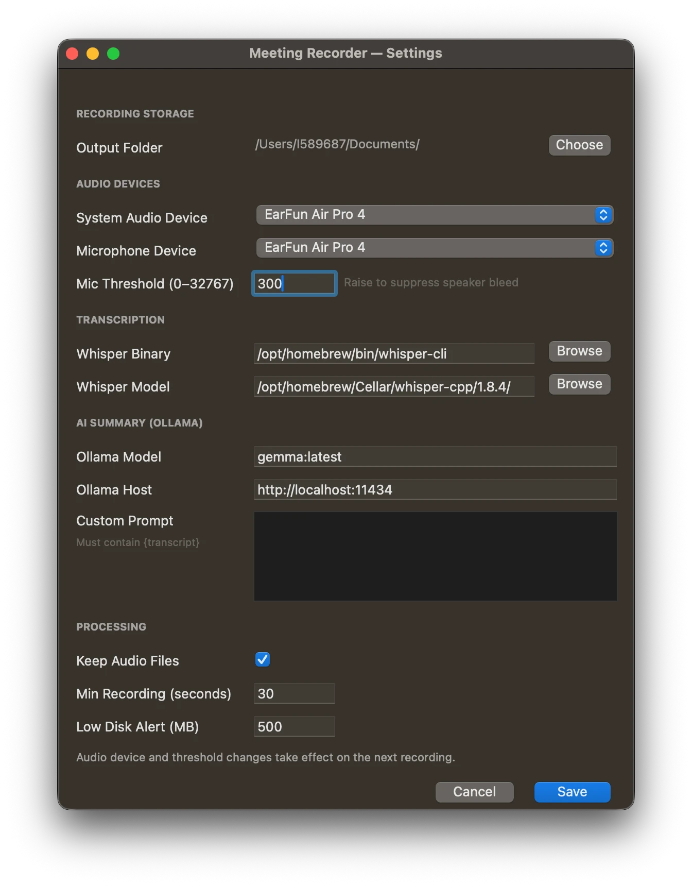
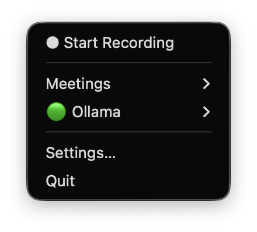
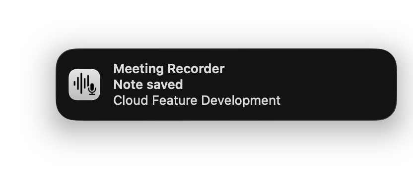

# Getting Started

This guide gets you from zero to your first recorded and summarized meeting note in about five minutes. It is written for macOS 14.2 Sonoma or newer — on that version there is no audio driver to install and nothing to configure about your sound output. If you are on an older OS, see the [legacy setup note](#macos-older-than-142) at the end.

---

## 1. Install the prerequisites

### whisper.cpp — local transcription

Install with Homebrew, then download the model:

```bash
brew install whisper-cpp
```

Find the version that was installed:

```bash
brew info whisper-cpp
```

Download the large-v3 model (approximately 3 GB) — adjust the version path to match what Homebrew installed:

```bash
curl -L -o /opt/homebrew/Cellar/whisper-cpp/1.8.4/share/whisper-cpp/ggml-large-v3.bin \
  "https://huggingface.co/ggerganov/whisper.cpp/resolve/main/ggml-large-v3.bin"
```

> The model path goes into your config later, so keep a note of where it landed.

### Ollama — local LLM for summaries (default, offline)

Download the Ollama desktop app from [ollama.com](https://ollama.com), install it, then pull a model:

```bash
ollama pull llama3.1:8b   # about 5 GB; works well on 16 GB RAM and above
```

Start the server before you use the app. You can do this from the terminal or later from the app's menu:

```bash
ollama serve
```

Leave it running in the background. It idles at 50–100 MB of RAM and only loads the model when a request arrives.

> **Using a hosted API instead?** If you prefer to use an OpenAI-compatible endpoint or the Anthropic API, Ollama is optional. You can skip this step and configure the `[llm]` table in config.toml (or Settings → Summarizer) after first launch. Store your API key in the Keychain with `security add-generic-password -s MeetingRecorder -a llm-api-key -w`. See the [README](../README.md#summarizer-configuration) for details.

---

## 2. Get the app

### Option A — receive a pre-built `.app` (recommended for teammates)

If a colleague has sent you `Meeting Recorder.app`:

1. Copy it to `/Applications`.
2. Right-click it in Finder and choose **Open** the first time, to bypass Gatekeeper's unknown-developer warning. Click **Open** in the dialog that appears.

### Option B — build it yourself

```bash
git clone https://github.com/ayushb3/meeting-recorder
cd meeting-recorder
python3 -m venv .venv
.venv/bin/pip install -r requirements.txt
.venv/bin/pyinstaller meeting_recorder.spec
```

The app appears at `dist/Meeting Recorder.app`. Copy it to `/Applications` if you want it in your Dock, or double-click it from `dist/`.

---

## 3. First launch and configuration

Double-click **Meeting Recorder.app** in Finder (not from a terminal — see why in the [troubleshooting guide](troubleshooting.md#terminal-launched-app-captures-silence)).

On first launch the app opens your config file automatically:

```
~/Library/Application Support/MeetingRecorder/config.toml
```

Fill in at minimum:

```toml
[paths]
output_dir = "~/Documents/Obsidian/Meetings"   # where notes are written

[audio]
# On macOS 14.2+, leave capture_method = "auto" — no further audio setup needed.
capture_method = "auto"
mic_device     = "MacBook Pro Microphone"      # run the command below to find yours

[whisper]
binary = "/opt/homebrew/bin/whisper-cli"
model  = "/opt/homebrew/Cellar/whisper-cpp/1.8.4/share/whisper-cpp/ggml-large-v3.bin"

[ollama]
model = "llama3.1:8b"
host  = "http://localhost:11434"
```

To find the exact name for `mic_device`, run:

```bash
.venv/bin/python -c "import sounddevice; print(sounddevice.query_devices())"
```

or, if you already have `sounddevice` globally:

```bash
python3 -c "import sounddevice; print(sounddevice.query_devices())"
```

Save the config file, then **relaunch the app** (quit from its menu bar icon, then open it again).

After the relaunch the app sits quietly in the menu bar with no Dock icon. You can also open **Settings…** from the menu to adjust the folder and device choices through a graphical window rather than editing the file by hand.



---

## 4. Grant the audio permission

The first time you click **Start Recording**, macOS will ask:

> "Meeting Recorder" would like access to the microphone.

Click **Allow**. This single permission covers both the microphone and system audio capture — the Core Audio process tap does not require a separate prompt.

If you missed the prompt, open System Settings → Privacy & Security → Microphone and enable **Meeting Recorder** there.

---

## 5. Recording your first meeting

**Important for macOS 14.2+:** you do not need to change your audio output device, route anything through BlackHole, or open Audio MIDI Setup. The app captures system audio at the source, before it reaches any output device. Your speakers, wired headphones, and Bluetooth earbuds all work without any changes.

Steps:



1. Make sure your summarizer is ready. If using Ollama (default), the menu bar icon shows **🟢 Ollama**; if it shows 🔴, click **Ollama ▸ Start Ollama in Terminal** to start it. If using a hosted API, the icon shows **🟢 Summarizer** when the endpoint is reachable and the API key is present.
2. Click the menu bar icon, then **● Start Recording**.
3. The icon changes and the item shows **■ Stop Recording — MM:SS** counting up.
4. Have your meeting.
5. Click **■ Stop Recording — MM:SS** when done.
6. A dialog asks for a meeting name (used as the folder name and note title). You can skip this and the LLM will choose a title automatically.
7. A second dialog asks for optional context to give the AI (for example: "Q2 planning with design team, focused on the redesign timeline"). This helps the summary focus on what matters. Skip it if you prefer.
8. The menu bar shows **Processing…** while the pipeline runs.
9. When the note is ready you receive a notification: **"Note saved — Your Meeting Title"**. Click it to open the note.

---

## Did it work? — quick verification

Record 30 seconds of audio from a YouTube video playing on your Mac, then stop recording. After the note is written you receive a notification like this:



After the note is written:

- Open the note from the notification or from **Meetings ▸** in the menu.
- Check the **Full Transcript** section — it should contain actual text from the video, not blank space or silence markers.
- The **TL;DR** and **Topics Covered** sections should contain a plausible AI summary.

If the transcript is empty, the system audio track was not captured — see [No system audio captured](troubleshooting.md#no-system-audio-captured) in the troubleshooting guide.

---

## macOS older than 14.2

On macOS 13 (Ventura) and earlier, the Core Audio process tap is unavailable. The app falls back automatically and tells you it has done so with a notification. That path requires BlackHole to be installed and a Multi-Output Device configured in Audio MIDI Setup — full instructions are in the [README](../README.md#on-macos-older-than-142-legacy-blackhole-setup).

The new tap path is the reason colleagues who remember the old setup instructions can ignore them on any Mac running Sonoma 14.2 or newer.

---

## Optional — importing meetings you did not record or attend

### Importing a local audio or video file

**Import Recording…** in the menu accepts any audio or video file your Mac can decode (mp3, m4a, mp4, mov, wav, …). It runs the same transcription and summarisation pipeline as a live recording. The original file is never moved.

### Importing a Teams/Stream transcript

For a recording made by someone else, **Import Transcript from Stream… ↗** takes the recording URL and scrapes the transcript into a note, with real speaker names.

It needs a one-time `playwright` install, a source checkout, and about ten seconds of your attention per run — the sign-in and opening the transcript panel cannot be automated. Full setup in [Importing Stream transcripts](stream-transcripts.md).
