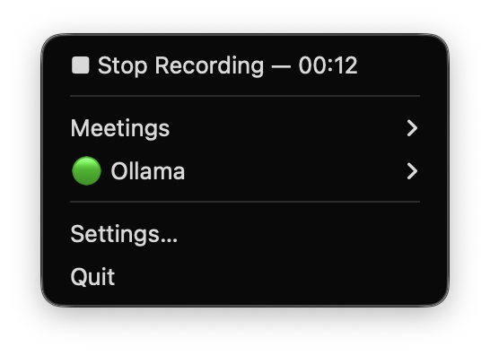
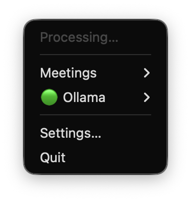
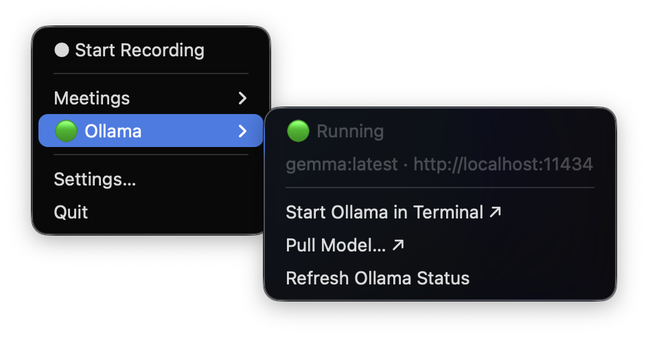

# Menu Reference

This page describes every item in the Meeting Recorder menu bar, what it does, and when it is enabled or disabled. All behaviour is derived from `ui/menu.py`.

See also: [docs/diagrams/menu-tree.svg](diagrams/menu-tree.svg) for a visual overview of the menu structure.

---

## Menu bar icon

The icon has two states:

| State | Appearance |
|---|---|
| Idle or processing | Standard template icon (adapts to light/dark menu bar) |
| Recording | Recording variant icon |

While recording, the elapsed time is shown next to the icon as a live counter (e.g. `03:42`). While the pipeline is running after you stop, it shows `Processing…`.

If the pipeline completes with a warning (summary unavailable), a `⚠` symbol appears briefly. If the pipeline fails entirely, `⚠ Error` is shown.

---

## Root menu items


### ● Start Recording

Starts capturing audio from both the microphone and the system audio tap simultaneously.

**Behaviour before starting:**
- If Ollama is not reachable (🔴), a notification warns you that the summary will be unavailable. Recording still starts — the transcript will always be captured.

**While recording**, this item changes to:

### ■ Stop Recording — MM:SS



Shows the elapsed recording time, updating every second. Click it to stop.

**After stopping:**
1. A single dialog appears with two optional fields:
   - **Suggested title** — used as the folder and note title. Leave blank to let the LLM choose a title from the transcript.
   - **Context for AI summary** — optional context (e.g. who attended, what the meeting was for). Leave blank if not needed.
   Click **Process** (or press Return) to proceed, or **Skip** to omit both fields.
2. The item changes to **Processing…** and is disabled while the pipeline runs.

   

3. When the note is written, the item returns to **● Start Recording**.

The item is disabled (no callback) while processing is in progress, preventing a second recording from starting before the first completes.

---

## Meetings ▸


A submenu listing your recent notes, grouped by day. The contents are rebuilt automatically every 45 seconds and immediately after each pipeline completes.

The app shows notes from the past two weeks. Notes are listed chronologically within each section with their time of day prefix (e.g. `09:00  Standup`).

### Section headers

**Today — Wed 16 Sep** (or whatever today's date is): lists all notes recorded today. Always present, even if empty.

**Earlier this week**: lists notes from the rest of the current week. Only appears when there are older notes.

### Individual note items

Each note is displayed as:

```
HH:MM  Meeting Name
```

Clicking it opens the note in your default Markdown editor (via `open`).

### ⚠ Degraded entries

When a note exists but the summary or transcript failed, the entry is shown as:

```
⚠ HH:MM  Meeting Name
```

This item has a submenu rather than a direct click action:

| Submenu item | What it does |
|---|---|
| **Open Note ↗** | Opens the note file, which will have a partial transcript or a placeholder summary |
| **Retry Summary** | Re-runs the full pipeline on the saved audio files from that session |
| **Reveal in Finder ↗** | Opens Finder with the session folder selected |

### Failed sessions (no note)

If a session failed before a note was written at all (for example, whisper.cpp crashed during transcription), a section labelled **Failed (no note)** appears. Each entry shows the session folder name with a ⚠ prefix and has a **Retry** child item.

### Location footer

At the bottom of the Meetings submenu:

| Item | What it does |
|---|---|
| `~/Documents/…/Meetings` | Shows the current output folder (non-clickable, display only) |
| **Open Meetings Folder ↗** | Opens the output directory in Finder |
| **Change Location…** | Opens the Settings window with the folder picker focused |

---

## 🟢/🟡/🔴 Ollama ▸

| Ollama healthy | Ollama unreachable |
|---|---|
|  |  |

The root item colour reflects the state of the Ollama server at a glance. It is probed asynchronously every 45 seconds and does not block menu rendering.

| Colour | Root item | Status line | What it means |
|---|---|---|---|
| 🟢 | `🟢 Ollama` | `🟢 Running` | Server is reachable and the configured model is available. Summaries will work. |
| 🟡 | `🟡 Ollama` | `🟡 Running — model not pulled` | Server is reachable but the configured model (`llama3.1:8b` by default) has not been pulled. Use **Pull Model…** to fix. |
| 🔴 | `🔴 Ollama` | `🔴 Not running` | No server at the configured host. Recording still works; summaries will not. |
| ⚪ | `⚪ Ollama` | `Checking…` | Initial state at launch, before the first probe completes. |

A detail line below the status shows the model name and host, for example:

```
llama3.1:8b · localhost:11434
```

or when the model is missing:

```
llama3.1:8b not found at http://localhost:11434
```

### Ollama submenu actions

| Item | What it does |
|---|---|
| **Start Ollama in Terminal ↗** | Opens Terminal and runs `ollama serve`. The app re-probes at 2, 5, 10, and 20 seconds after you click it, so the status updates automatically once the server is up. |
| **Pull Model… ↗** | Opens Terminal and runs `ollama pull <model>` with the model name from your config. Re-probes at 5, 15, 30, and 60 seconds. |
| **Refresh Ollama Status** | Triggers an immediate background probe. Useful after manually starting Ollama without using the menu. |

---

## Settings…

Opens the Settings window with a folder picker for the output directory and dropdowns for the microphone and system audio device. Writing through this window is equivalent to editing `config.toml` by hand.

---

## Quit

Quits the application. Any in-progress recording is not automatically stopped first, so stop a recording before quitting if you want it saved.

---

## Notifications


When the pipeline completes successfully, a macOS notification is sent:

- **Title:** Meeting Recorder
- **Subtitle:** Note saved
- **Body:** The meeting title (as chosen by you or by the LLM)

Clicking the notification opens the note file directly.

If the summary was unavailable (Ollama was down), the notification subtitle changes to **Note saved (summary unavailable)** and does not carry a click-to-open action for the note, since the note still exists and can be found in **Meetings ▸**.

If a recording is too short (under `min_recording_seconds`, defaulting to 30 seconds), a notification says **Recording too short — discarded** and no files are saved.
