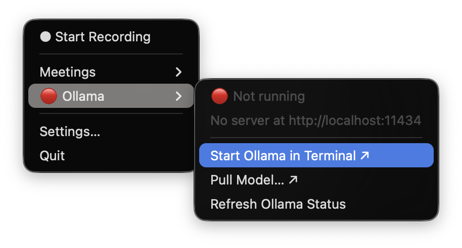

# Troubleshooting

Each entry follows the pattern: **symptom you see → cause → what to do**.

---

## No system audio captured

**Symptom:** After stopping a recording you get a notification: "No system audio captured — Only your microphone was recorded." The note has a transcript of your voice but nothing from the other side of the call or from any other app.

The app checks the RMS level of the recorded system track and warns when it is effectively silent (all zeros). Both capture paths fail this way rather than raising an error.

### Using the Core Audio tap path (macOS 14.2+)

**Cause:** The app does not have audio recording permission, or it was launched from a terminal rather than as a bundle.

**Fix:**
1. Open System Settings → Privacy & Security → Microphone.
2. Make sure **Meeting Recorder** is listed and enabled.
3. If it is not listed, launch the app from Finder or the Dock (not from a terminal) — the permission prompt only appears when the OS can verify the app's bundle identity.
4. After granting permission, re-record.

### Using the BlackHole loopback path (macOS < 14.2 or `capture_method = "blackhole"`)

**Cause:** The output device in use is not the Multi-Output Device that includes BlackHole, so audio is not being routed through the loopback.

**Fix:**
1. Open **Audio MIDI Setup** (Applications → Utilities).
2. Confirm that the Multi-Output Device you created includes both BlackHole 2ch and your speakers or headphones.
3. Right-click that Multi-Output Device and confirm **Use This Device for Sound Output** is selected (it should have a speaker icon).
4. If BlackHole and your headphones are members of the Multi-Output Device but you still hear nothing or capture fails, check that all members share the same sample rate — see the Bluetooth sample-rate trap below.

---

## Terminal-launched app captures silence

**Symptom:** You started the app with `python app.py` from your terminal. Everything appears to work, but the system audio track is silent and no permission prompt ever appeared.

**Cause:** macOS grants audio capture to an app bundle launched via LaunchServices (Finder, Dock, or `open`). A process started from a shell inherits the terminal's privacy context and is silently refused — the refusal produces no error, just a track full of zeros.

**Fix:** Always launch Meeting Recorder from Finder, the Dock, or with:

```bash
open "dist/Meeting Recorder.app"
```

Use `python app.py` only for menu and pipeline development work where you do not need real system audio.

---

## Ollama is unreachable (🔴 in the menu)

**Symptom:** The Ollama submenu shows 🔴 and "Not running" as shown below. Recording still works, but notes are saved without a summary and the AI-generated title.



**Cause:** The Ollama server is not running. (If you are using a hosted API instead of Ollama, see [Hosted summarizer: endpoint unreachable](#hosted-summarizer-endpoint-unreachable--fell-back-to-ollama) below.)

**Fix:**
1. Click **Ollama ▸ Start Ollama in Terminal ↗**. A Terminal window opens running `ollama serve`. The app re-probes automatically after a few seconds.
2. Alternatively, run `ollama serve` yourself in a terminal or use the Ollama desktop app (which starts the server automatically on login).
3. Once the icon turns 🟢, any pending summaries can be retried (see below).

Recording is never blocked by the summarizer. You can record at any time regardless of its state; only the summary step requires it.

---

## Summary is missing from a note (⚠ in the Meetings menu)

**Symptom:** The note exists and has a transcript, but the **TL;DR**, **Topics Covered**, **Key Decisions**, and **Action Items** sections are empty or contain a placeholder. The Meetings menu shows ⚠ before the meeting name.

**Cause:** The summarizer (Ollama or a hosted API) was unreachable or returned an error during the pipeline run.

**Fix:**
1. Make sure Ollama is running (🟢 in the menu).
2. In the Meetings submenu, click the **⚠ Meeting Name** entry. A submenu appears.
3. Click **Retry Summary**. The app re-runs the full pipeline on the saved audio files. The menu bar shows **Processing…** during this.
4. When it completes, a new notification arrives and the ⚠ is removed from the entry.

The original audio files are preserved alongside the note (`audio-mic.wav` and `audio-system.wav` in the session folder) specifically to make this retry possible.

---

## Recording was discarded as too short

**Symptom:** After stopping a recording you get a notification: "Recording too short — discarded." No note and no audio files are saved.

**Cause:** The recording was shorter than `min_recording_seconds` in your config (default: 30 seconds). This prevents accidental single-click recordings from creating junk notes.

**Fix:**
- If the recording was genuinely too short, nothing to do — it was intentional.
- If you need to record shorter clips, open `~/Library/Application Support/MeetingRecorder/config.toml` and lower `min_recording_seconds` under `[processing]`.

---

## Recording stopped automatically mid-meeting

**Symptom:** The recording stopped by itself, without you clicking Stop. A dialog may have appeared.

**Cause:** The disk is running low. The app monitors free disk space every second while recording and stops automatically when free space falls below `low_disk_threshold_mb` (default: 500 MB).

**Fix:**
- Free up disk space.
- If you need more headroom before the app intervenes, raise `low_disk_threshold_mb` in your config, but keep a reasonable floor to avoid filling the disk entirely.

---

## Bluetooth sample-rate trap (macOS < 14.2 / BlackHole path only)

**Symptom:** After setting up a Multi-Output Device with BlackHole and Bluetooth earbuds, you either hear nothing from the earbuds or the earbuds disappear from the output device list.

**Cause:** All members of a Multi-Output Device must share a sample rate. Bluetooth earbuds commonly operate at 44100 Hz, while BlackHole defaults to 48000 Hz. When the rates disagree, macOS silently drops the mismatched device.

**Fix:**
1. Open **Audio MIDI Setup**.
2. Select your Bluetooth earbuds in the left pane and note the sample rate shown.
3. Select BlackHole 2ch and change its sample rate to match the earbuds.
4. Select the Multi-Output Device and verify both devices show the same rate.

Alternatively, use wired headphones or speakers for meetings where you need the BlackHole path — they do not have this limitation.

Note: this entire issue does not apply on macOS 14.2+ because the Core Audio tap path does not route audio through any output device at all.

---

## "Model not pulled" (🟡 Ollama)

**Symptom:** The Ollama submenu shows 🟡 and "Running — model not pulled". The server is running but summaries fail.

**Cause:** The model name in your config (for example `llama3.1:8b`) has not been downloaded.

**Fix:**
1. Click **Ollama ▸ Pull Model… ↗**. This opens Terminal and runs `ollama pull llama3.1:8b` (or whatever model is in your config). The download is several GB and may take a few minutes.
2. The app re-probes automatically; the icon will turn 🟢 when the pull completes.

---

## Config file not found or invalid at launch

**Symptom:** The app does not appear in the menu bar, or it opens a text file and then nothing happens.

**Cause:** Either this is first launch (config does not exist yet and the template was just copied), or the config file has a validation error.

**Fix for first launch:**
1. The app opened your config file in a text editor automatically.
2. Fill in the required paths (see [Getting Started](getting-started.md)).
3. Save the file, then quit and relaunch the app.

**Fix for a config error:**
1. Open `~/Library/Application Support/MeetingRecorder/config.toml` in a text editor.
2. Check for:
   - `[whisper] binary` pointing to a file that does not exist — run `which whisper-cli` to find the correct path.
   - `[whisper] model` pointing to a model file that has not been downloaded.
   - `[audio] capture_method` set to a value other than `auto`, `tap`, or `blackhole`.
   - `[ollama] prompt` that does not contain the literal text `{transcript}`.
3. Fix the issue, save, and relaunch.

---

## Note opened but file not found

**Symptom:** After clicking a meeting in the Meetings submenu, a notification says "Note not found — The file may have been moved."

**Cause:** The session directory was renamed or moved after the note was written (for example, you reorganised your Obsidian vault). The path cached in the menu is now stale.

**Fix:** Click **Open Meetings Folder ↗** in the Meetings submenu to browse to the note manually in Finder. In future, avoid moving session folders out of the output directory structure.

---

## App shows "⚠ Error" in menu bar

**Symptom:** The menu bar shows `⚠ Error` and a notification says "Processing failed — Stage: [name]."

**Cause:** One of the pipeline stages (transcription, note writing) failed with an unexpected error. The error stage name is shown in the notification.

**Fix:**
1. The session folder still exists with the audio files preserved.
2. Check whether whisper.cpp is installed and working: run `whisper-cli --help` in a terminal.
3. In the Meetings submenu, find the failed session (it will be listed under "Failed (no note)" or with a ⚠) and click **Retry** to re-run the pipeline.
4. If transcription keeps failing, check that `[whisper] binary` and `[whisper] model` paths in your config both exist.

---

## Hosted summarizer: no API key

**Symptom:** The Summarizer submenu shows 🔴 and a label like `LLM: no API key (gpt-4o)`. Summaries fail or fall back to Ollama.

**Cause:** No key was found in the macOS Keychain under service `MeetingRecorder`, account `llm-api-key`, and the `MEETING_RECORDER_LLM_KEY` environment variable is also unset. A menu-bar app launched from Finder does not inherit shell environment variables, so the Keychain is the correct path for the app itself.

**Fix:**

```bash
security add-generic-password -s MeetingRecorder -a llm-api-key -w
# (prompts for the key interactively)
```

Run this once. The app reads the Keychain on every summary request, so you do not need to relaunch. For scripts and tests you can also set `MEETING_RECORDER_LLM_KEY` in your shell.

To verify the key was stored: `security find-generic-password -s MeetingRecorder -a llm-api-key -w`

---

## Hosted summarizer: model not offered

**Symptom:** The Summarizer submenu shows 🔴 and a label like `LLM: gpt-5-turbo not offered`. The endpoint is reachable but summaries fail.

**Cause:** The `[llm] model` in your config is not in the list returned by the endpoint's `/models` API. Either the model name is misspelled, the model has been renamed or retired, or it is not available on your plan/tier.

**Fix:**
1. Open **Settings… → Summarizer**. If a base URL and API key are present, the model dropdown is populated live from the endpoint. Choose a model from that list.
2. Alternatively, edit `~/Library/Application Support/MeetingRecorder/config.toml` and correct `[llm] model` to a name the endpoint actually serves.

---

## Hosted summarizer: endpoint unreachable — fell back to Ollama

**Symptom:** The Summarizer submenu shows 🔴 with a label like `LLM: http://localhost:6655/openai/v1 unreachable — Ollama fallback on`. Summaries succeed but use Ollama rather than the configured hosted model.

**Cause:** The configured `base_url` did not respond (connection refused, timeout, or network error). Common causes: you are off VPN, a local gateway proxy is not running, or the URL is wrong.

**Behaviour:** When `fallback_to_ollama = true` (the default), the summary is retried against your local Ollama server rather than being lost. The note is written normally; you can tell it used the fallback from the Summarizer status in the menu.

**Fix:**
- To restore the hosted model: bring the endpoint back up or reconnect to the network.
- To disable the fallback (fail loudly instead of silently downgrading): set `fallback_to_ollama = false` in `[llm]`.
- To always use Ollama: set `[llm] provider = "ollama"` and leave `base_url` and `model` empty.

---

## Stream transcript import fails

**Symptom:** **Import Transcript from Stream… ↗** opens Terminal, which reports an error instead of writing a note.

**Cause and fix depend on the message.** The scraper names every failure deliberately, because the two easy confusions — a policy block versus a slow sign-in, a closed panel versus changed markup — send you looking in completely different places.

| Message | Fix |
|---|---|
| `playwright is not installed` | `.venv/bin/pip install playwright` |
| `Could not launch Google Chrome` | Install Chrome, or check it is at `/Applications/Google Chrome.app` |
| `No transcript markup found` | The transcript panel was not open. Open it in the Chrome window and re-run |
| `Transcript-like markup is present but no rows matched` | Microsoft changed the markup. The message lists what it did find; the selector needs re-deriving in DevTools |
| `Incomplete: N/M rows` | Retry with `--steps` doubled from the command line |
| `N row(s) were collected but produced no transcript line` | The speaker-label format changed. The message shows the offending rows |
| `AADSTS…` codes during sign-in | Conditional Access is refusing the automated browser. No code change fixes this; the code is quotable to IT |

**Nothing happens when you click the menu item:** the scraper lives in `scripts/` and is not part of the `.app` bundle, so it needs a source checkout. The item reports a missing script rather than failing silently — check the notification.

**Sign-in is asked for every time:** the session profile at `~/.cache/meeting-recorder-spike/chrome-profile` is being cleared, or was deleted. It normally persists between runs.

See [Importing Stream transcripts](stream-transcripts.md) for the full guide.
